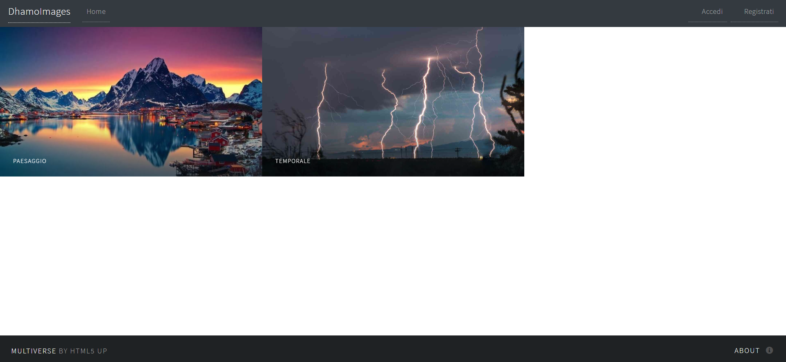
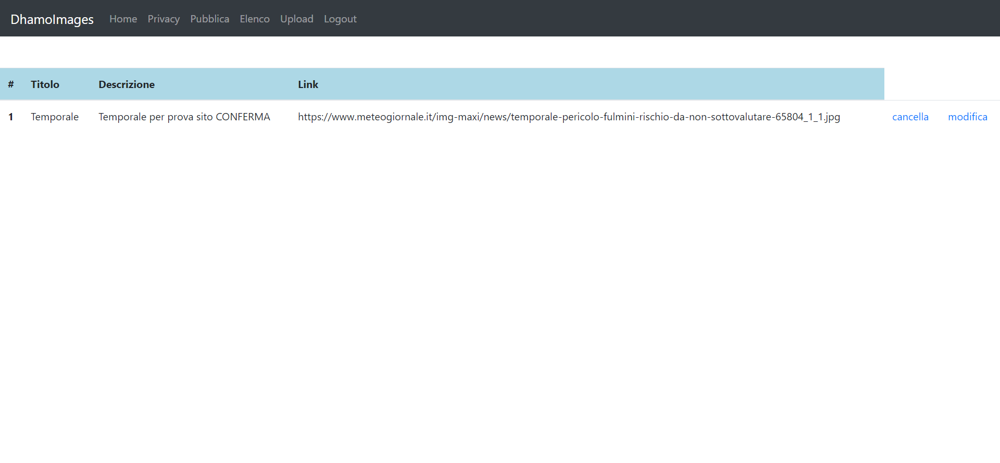
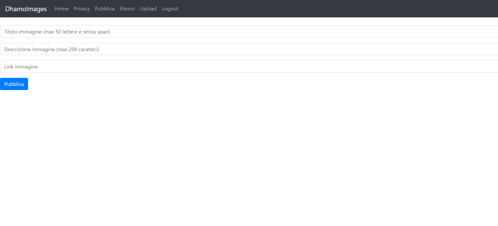

# SecondaWeb
Il sito permette a fotografi di ogni rango di poter pubblicare in maniera completamente gratuita i loro scatti migliori. Ad ogni foto verrà associata ad un titolo e una breve descrizione scritta dal fotografo. Il sito è ancora in sviluppo...

## Login
Per poter inserire le immagini il fotografo dovrà loggarsi nella sezione "Accedi" e se non dovesse aver creato un account può farlo nella sezione "Registrati"

## Elenco

L'utente potrà visualizzare tutte le immagine che ha caricato e per ognuna di esse potrà modificarne le informazioni tramite il comando "modifica" o eliminarlo tramite il comando "cancella"

## Pubblica

L'utente potrà tramite la schermata "Pubblica" inserire una nuova immagine. L'immagine dovrà contenere un titolo, una descrizione e il link della foto. La prossima versione permetterà all'utente di uploadare una immagine da una cartella locale sul proprio computer

